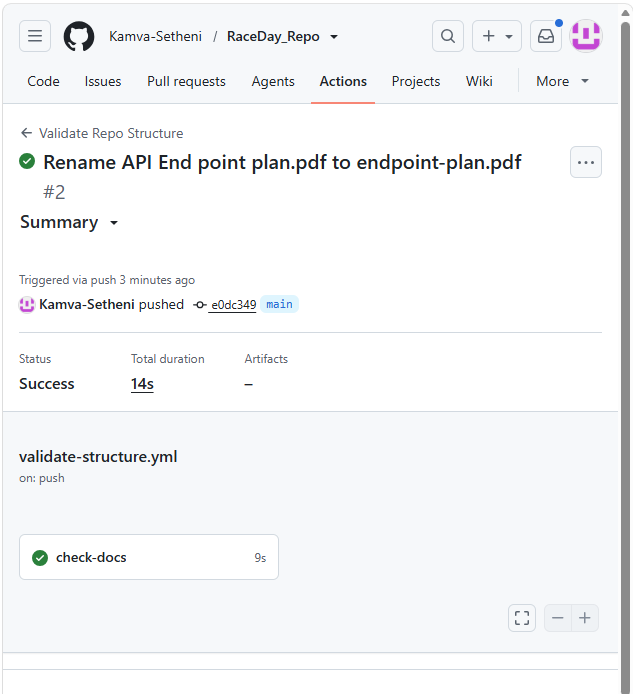

# RaceDay_Repo
This is my personal repository that is meant for the use of Part 1 and potentially other parts of my Programing POE 

# RaceDay - Event Management System

RaceDay is a full-stack, API-driven event management platform built for the 
South African road running, walking, and cycling community. It allows Event 
Organisers to create and manage events, categories, and participant results, 
while Participants can browse events, enter races, and track their personal 
performance history.

This repository contains "Part 1" of a three-part Portfolio of Evidence: 
system planning and database design.

## Roles

- "Organiser" - Can create, edit, and delete events, manage event categories, 
  capture participant results, and view all enrolments for their events.
- "Participant" - Can create an account, browse events, enter an event by 
  selecting a category, view their own enrolments, and track their personal 
  results and payment history.

  ## CI/CD

A GitHub Actions workflow (`.github/workflows/validate-structure.yml`) runs 
on every push and verifies that the `/docs` folder and all required planning 
files are present.

**CI/CD green build screenshot:**

## Setup Instructions

1. Clone this repository.
2. Open SQL Server Management Studio (SSMS) and connect to a local or clean 
   SQL Server instance.
3. Open `docs/raceday-schema.sql` and execute it. This creates the `Users`, 
   `Events`, `Categories`, `Enrolments`, `Results`, and `Payments` tables and 
   seeds them with sample data.
4. Review `docs/erd.png` for the full data model and `docs/endpoint-plan.pdf` 
   for the planned API surface (to be implemented in Part 2).
